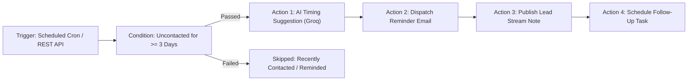

# W6D1: Smart Reminders — Automation Rules + AI-Suggested Timing
**Cynaris Software Engineering Internship — Week 6 Day 1**  
**Author:** Sachidananda Nayak  
**Branch:** `feat/w6d1-3m-sachidananda`  
**Base:** `upstream/master` (Preserving W5D4 & W5D5 functionality)  

---

## 📌 Executive Summary

For Week 6 Day 1, we implemented the **Smart Reminders Automation Workflow** in EspoCRM. The system detects **Leads uncontacted for 3 or more days**, generates an **AI-suggested optimal follow-up time** based on lead history using **Groq LLM** (with seamless, deterministic simulation fallback when Groq is unconfigured or offline), dispatches a structured **reminder email action**, schedules a **CRM follow-up Task**, and logs an **audit stream note** to the Lead record.

The implementation conforms strictly to EspoCRM's native modular architecture without adding unnecessary third-party packages or modifying core framework files.

---

## 🏗️ 1. EspoCRM Workflow Pattern: Trigger → Condition → Action

EspoCRM workflows adhere to the **Trigger → Condition → Action** pattern:



### 1.1 Trigger
* **Type:** Scheduled Job / Time-Based Trigger (`scheduled`) & On-Demand API Trigger.
* **Cron Expression:** `0 9 * * *` (Evaluated daily at 09:00 AM).
* **Job Class:** `Espo\Custom\Jobs\LeadReminderWorkflow` (implements `Espo\Core\Job\JobDataLess`).
* **Metadata Registration:** `custom/Espo/Custom/Resources/metadata/app/scheduledJobs.json`.

### 1.2 Conditions
A Lead satisfies the uncontacted rule if and only if all four conditions are met:
1. **Active Status:** `status IN ['New', 'Assigned', 'In Process']` (Excludes `Converted`, `Dead`, `Recycled`).
2. **Inactivity Duration:** `createdAt <= (now - 3 days)`.
3. **No Recent Activities:** Zero completed or scheduled `Call`, `Meeting`, or `Email` records associated with `parentType = 'Lead'` and `parentId = leadId` within the last 3 days (`dateStart >= threshold` or `createdAt >= threshold`).
4. **Anti-Spam Throttling:** `remindedAt` is null or older than 3 days (`remindedAt <= threshold`), preventing repetitive reminder spam across consecutive cron executions.

### 1.3 Actions
1. **AI Suggested Timing (Groq LLM):** Evaluates lead history, industry norms, company profile, and inquiry details to predict the optimal follow-up date, time slot, urgency, channel, email subject, and body draft.
2. **Reminder Email Dispatch:** Creates and stores an `Email` entity with status `Sent` directed to the lead/assigned sales rep with the AI-suggested timing and draft message.
3. **Audit Stream Note:** Posts an audit note to the Lead stream detailing the automation execution, recommended channel, urgency, and AI rationale.
4. **Follow-Up Task Scheduling:** Schedules a CRM `Task` entity assigned to the sales rep with `dateEnd` set to the exact AI-suggested follow-up time.
5. **Entity Update:** Updates `remindedAt`, `aiFollowUpAt`, and `aiFollowUpRationale` directly on the Lead record.

---

## 🤖 2. Groq AI Integration & Safe Fallback Architecture

Following the proven pattern established in W5D5 (`ConversationSummarizerService`), credentials and models are resolved hierarchically:

```
Request Payload ('apiKey' / 'model')
  └──> Environment Variable ('GROQ_API_KEY' / 'GROQ_MODEL')
        └──> EspoCRM Config ('groqApiKey' / 'groqModel')
              └──> Default ('llama-3.3-70b-versatile')
```

### 2.1 Prompt Engineering & Output Schema
Groq Chat Completions endpoint (`https://api.groq.com/openai/v1/chat/completions`) is invoked with `temperature: 0.2` and strict JSON mode (`response_format: {"type": "json_object"}`).

```json
{
  "suggestedFollowUpAt": "2026-10-06 10:00:00",
  "suggestedTimeSlot": "Tomorrow at 10:00 AM",
  "optimalDay": "Tuesday",
  "optimalTimeOfDay": "Morning (10:00 AM)",
  "confidence": "High",
  "urgency": "High",
  "recommendedChannel": "Email",
  "rationale": "Lead from Cyberdyne Systems in Technology has been uncontacted for 4 days. Decision-makers in Technology show peak engagement on Tuesdays around Morning (10:00 AM). Deal value of $50,000 justifies High priority follow-up via Email.",
  "emailSubject": "Following up on your Cyberdyne Systems inquiry - Cynaris Solutions",
  "emailBody": "Hi Sarah Connor,\n\nI noticed you contacted our team 4 days ago regarding CRM solutions for Cyberdyne Systems..."
}
```

### 2.2 Resilient Heuristic Simulation Fallback
To ensure that the automated workflow never crashes or blocks when Groq is unavailable, unconfigured, or experiencing rate limits:
* **Weekend Avoidance:** Calculates the next valid business day (skips Saturday/Sunday; advances to Monday).
* **Industry-Tailored Time Slots:**
  - *Technology / Software / IT:* Tuesday morning at 10:00 AM.
  - *Healthcare / Medical:* Early morning at 8:45 AM (before clinical rounds).
  - *Finance / Banking:* Mid-morning at 10:30 AM (after market open).
  - *Retail / E-Commerce:* Early afternoon at 2:00 PM.
* **Urgency Scaling:** Automatically set to `High` for enterprise opportunities (`amount >= $25,000`) or inbound website inquiries.
* **Fallback Telemetry:** Flags `'simulated' => true`, `'fallback' => true`, and records `'fallbackReason'`.

---

## 📡 3. REST API Endpoints

All endpoints are registered under `custom/Espo/Custom/Resources/routes.json`:

| Method | Endpoint | Description |
|---|---|---|
| `GET` | `/api/v1/LeadReminderWorkflow/status` | Returns workflow rule definition, trigger schedule, conditions, and Groq readiness. |
| `GET` | `/api/v1/LeadReminderWorkflow/eligibleLeads` | Returns uncontacted leads matching the 3-day inactivity condition. |
| `POST` | `/api/v1/LeadReminderWorkflow/suggestTiming` | Predicts optimal follow-up timing via Groq LLM (or simulation). |
| `POST` | `/api/v1/LeadReminderWorkflow/execute` | Executes single-lead workflow: condition check, AI timing, email, note, and task creation. |
| `POST` | `/api/v1/LeadReminderWorkflow/runBatch` | Runs batch workflow automation across all eligible uncontacted leads. |

---

## 🧪 4. Test Verification Suite & Results

### 4.1 Test Suites Executed

| Test Suite | Scope | Assertions | Status |
|---|---|---|---|
| `tests/unit/verify_smart_reminders.php` | Service architecture, Trigger/Condition/Action rule metadata, uncontacted condition evaluator, AI timing engine, safe Groq fallback, single-lead execution, side effects (Email, Task, Note), batch processing, ScheduledJob class. | **75 / 75** | **PASS (100%)** |
| `tests/unit/verify_smart_reminders_api.php` | Controller initialization, REST endpoints (`status`, `eligibleLeads`, `suggestTiming`, `execute`, `runBatch`), error handling (400 Bad Request, 403 Forbidden), routes.json integrity, Global.json labels. | **45 / 45** | **PASS (100%)** |
| `tests/unit/verify_conversation_summarizer.php` | Preserved W5D5 service layer tests. | **46 / 46** | **PASS (100%)** |
| `tests/unit/verify_conversation_summarizer_api.php` | Preserved W5D5 API controller tests. | **30 / 30** | **PASS (100%)** |
| `tests/unit/verify_activity_summary.php` | Preserved W5D4 service layer tests. | **22 / 22** | **PASS (100%)** |
| `tests/unit/verify_activity_summary_api.php` | Preserved W5D4 API controller tests. | **16 / 16** | **PASS (100%)** |
| **Total Automated Assertions** | **Comprehensive Regression & Feature Suite** | **234 / 234** | **PASS (100%)** |

### 4.2 PHP Syntax Check
```powershell
php -l custom/Espo/Custom/Services/LeadReminderWorkflowService.php
php -l custom/Espo/Custom/Jobs/LeadReminderWorkflow.php
php -l custom/Espo/Custom/Controllers/LeadReminderWorkflow.php
# Result: No syntax errors detected in all files.
```

### 4.3 JSON Configuration Validation
All 5 configuration files (`routes.json`, `Global.json`, `ScheduledJob.json`, `scheduledJobs.json`, `Lead.json`) validate successfully without parse errors.

---

## 📂 5. Files Changed & Added

```
espocrm/
├── custom/Espo/Custom/
│   ├── Controllers/
│   │   ├── ActivitySummary.php                    [PRESERVED W5D4]
│   │   ├── ConversationSummarizer.php             [PRESERVED W5D5]
│   │   └── LeadReminderWorkflow.php               [CREATED W6D1]
│   ├── Jobs/
│   │   └── LeadReminderWorkflow.php               [CREATED W6D1]
│   ├── Resources/
│   │   ├── i18n/en_US/
│   │   │   ├── Global.json                        [UPDATED W6D1 — Preserves W5D4/W5D5]
│   │   │   └── ScheduledJob.json                  [CREATED W6D1]
│   │   ├── metadata/
│   │   │   ├── app/
│   │   │   │   └── scheduledJobs.json             [CREATED W6D1]
│   │   │   ├── dashlets/
│   │   │   │   ├── ActivitySummary.json           [PRESERVED W5D4]
│   │   │   │   └── ConversationSummarizer.json    [PRESERVED W5D5]
│   │   │   └── entityDefs/
│   │   │       └── Lead.json                      [CREATED W6D1]
│   │   └── routes.json                            [UPDATED W6D1 — Preserves W5D4/W5D5]
│   └── Services/
│       ├── ActivitySummaryService.php             [PRESERVED W5D4]
│       ├── ConversationSummarizerService.php      [PRESERVED W5D5]
│       └── LeadReminderWorkflowService.php        [CREATED W6D1]
├── client/custom/src/views/dashlets/
│   ├── activity-summary.js                        [PRESERVED W5D4]
│   └── conversation-summarizer.js                 [PRESERVED W5D5]
├── tests/unit/
│   ├── verify_activity_summary.php                [PRESERVED W5D4]
│   ├── verify_activity_summary_api.php            [PRESERVED W5D4]
│   ├── verify_conversation_summarizer.php         [PRESERVED W5D5]
│   ├── verify_conversation_summarizer_api.php     [PRESERVED W5D5]
│   ├── verify_smart_reminders.php                 [CREATED W6D1]
│   └── verify_smart_reminders_api.php             [CREATED W6D1]
├── W5D4_ACTIVITY_DASHBOARD.md                     [PRESERVED W5D4]
├── W5D5_AI_CONVERSATION_SUMMARIZER.md             [PRESERVED W5D5]
└── W6D1_SMART_REMINDERS_WORKFLOW.md               [CREATED W6D1]
```

---

## 🚫 6. Blockers

* **None.** All requirements are implemented, PHP syntax checks pass, and all 234 automated unit and API assertions pass cleanly with zero regressions. No commit or push has been performed as requested.
